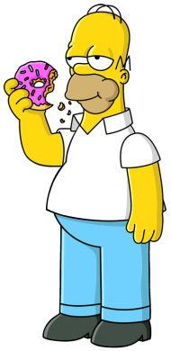

# simpson Taskbar

A Windows 7-inspired taskbar recreation and for Windows 10 and 11.

SimpsonTaskbar is a system utility that recreates the simpson-style taskbar and Superbar using a beer frontend with a native doughnuts backend.

### Doh

**Current state: `COMPLETE`**

## Screenshot (homie skin)

## Screenshot (bar skin)

## Requirements

* pc
* need to live in springfiled

> ⚠️ **Compatibility warning**
>
it won’t work with anything else
only have simpsonbar installed

## Installation Guide

To install this software, the subsequent steps need to be followed:
1. Buy donut at quicky mart
2. Go to moe bar
3.Say: douuuuuuuuuuhhhhhhhhhhh very loud

## Current status

SimpsonBar is Feature Complete! Can use as replacement

## Build

## Contributing

No

## Credits

* ME EBERYTHHING

## License

This software is licensed under **GNU GPL v3.0 or later**.

See [`LICENSE`](./docs/LICENSE), [`CREDITS.txt`](./docs/CREDITS.txt), and [`THIRD-PARTY-NOTICES.md`](./docs/THIRD-PARTY-NOTICES.md) for licensing and attribution details.
